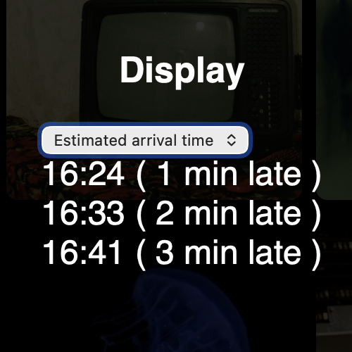

# API Request with python

This project is a simple API to get the tram stop timetables from the TBM API.
In this case, the tram stop is Doyen Brus towards Bordeaux.

*To find the lineRef and monitoringRef, you need to look at the routes.txt file in the gtfs folder.*

Possible improvements

- Add the possibility to choose the stop
- Add cache system to avoid calling the API too often
- Add system to create a widget to display the departures
